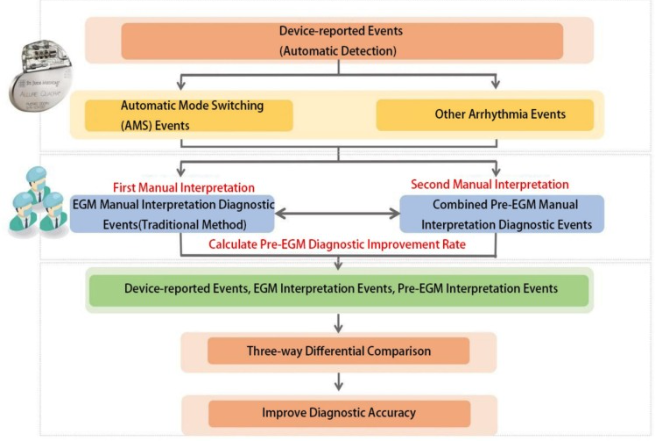

# Expert-driven electrophysiology analysis
([Analysis of the diagnostic value of pre-event intracardiac electrogram (pre-EGM) storage function in cardiac electronic implantable devices for arrhythmia diagnosis](https://www.sciencedirect.com/science/article/pii/S0167527325009246?casa_token=HT0rEf662hwAAAAA:u6vl9wFOUMiNfA-bsy0Ai2viEfoHZwCZR46g7LccH0Cl8AC5KRUWv8p6iydjellkJd0T1zrJ-oE)) (Cardiology 2025)

**Main point:** 
This study demonstrated that incorporating pre-event intracardiac electrograms (Pre-EGM)(14s-1min) significantly improves the diagnostic accuracy of arrhythmic events recorded by cardiac implantable electronic devices. 

**Methods:** 

**Pros:** 

**Cons:** 

([The Value of Defibrillator  Electrograms for Recognition of  Clinical Ventricular Tachycardias and for Pace  Mapping of Post-Infarction Ventricular Tachycardia](https://www.jacc.org/doi/abs/10.1016/j.jacc.2010.04.043)) (JACC 2012)

**Main point:** 
Intracardiac electrograms stored in ICDs show reproducible morphology during ventricular tachycardia episodes. Morphology similarity analysis can accurately identify clinical VT and assist in VT localization for ablation planning. 

**Methods:** 

**Pros:** 

**Cons:** 

# EGM waveform feature-based method to VT detection/prediction 

([Enabling Pre-Shock State Detection using Electrogram Signals from Implantable Cardioverter-Defibrillators](https://dl.acm.org/doi/abs/10.1145/3589335.3651450))(WWW '24: Companion Proceedings of the ACM Web Conference 2024)

**Main point:** 
The study shows that intracardiac EGM signals recorded before a ventricular arrhythmia contain detectable patterns. By combining Siamese LSTM–based metric learning, prototype learning, and few-shot learning, the proposed model can distinguish normal signals from pre-shock signals and achieve strong performance (F1 ≈ 0.87). 

**Methods:** 

**Pros:** 

**Cons:** 

([Intracardiac QT integral on far-field ICD electrogram predicts sustained ventricular tachyarrhythmias in ICD patients](https://www.heartrhythmjournal.com/article/S1547-5271(11)00849-6/abstract)) (HeartRhythm 2011)

**Main point:** 
The study shows that Far-field ICD electrogram QT integral measured during sinus rhythm can predict future VT/VF events months in advance. 

**Methods:** 

**Pros:** 
months
**Cons:** 

([Prediction of Ventricular Tachyarrhythmias by Intracardiac Repolarization Variability Analysis](https://pubmed.ncbi.nlm.nih.gov/38797305/)) (Circulation 2009/6)

**Main point:** 
This study demonstrated that beat-to-beat QT variability derived from intracardiac electrograms recorded by ICD devices can predict future ventricular tachyarrhythmias. Increased QT variability index (QTVI) measured from both near-field and far-field EGMs was associated with a significantly higher risk of subsequent VT/VF events. 

**Methods:** 

**Pros:** 

**Cons:** 

# ICD device diagnostic data to VT detection/prediction

([Development and validation of warning  system of ventricular tachyarrhythmia in  patients with heart failure with heart rate  variability data](https://journals.plos.org/plosone/article?id=10.1371/journal.pone.0207215)) (Plos 2018/11)

**Main point:** 
Machine learning models trained on HRV features from ICD data can moderately predict ventricular tachyarrhythmia minutes or seconds before onset. 

**Methods:** 

**Pros:** 

**Cons:** 

([Prediction of Sudden Cardiac Death Risk with a Support Vector Machine Based on Heart Rate Variability and Heartprint Indices](https://www.mdpi.com/1424-8220/20/19/5483)) (Biomedical Sensors 2020/9)

**Main point:** 
This study shows that combining HRV features and PVC-related heartprint features derived from ICD RR interval recordings can help predict imminent ventricular tachyarrhythmia events using an SVM classifier. 

**Methods:** 

**Pros:** 

**Cons:** 

# AI-based arrhythmia prediction

([Machine learning for prediction of ventricular arrhythmia episodes from intracardiac electrograms of automatic implantable cardioverter-defibrillators](https://pubmed.ncbi.nlm.nih.gov/38797305/)) (HeartRhythm 2024/11)

**Main point:** 
This study applied convolutional neural networks to far-field intracardiac electrograms recorded by ICDs and demonstrated that machine learning models can predict ventricular tachycardia or ventricular fibrillation seconds before onset, although mid- and long-term prediction of arrhythmia events was not successful. 

**Methods:** 

**Pros:** 
Deep learning

**Cons:** 
IEGM within 5 seconds before the VA onset. 

# Catheter-guided EGM-targeted ablation